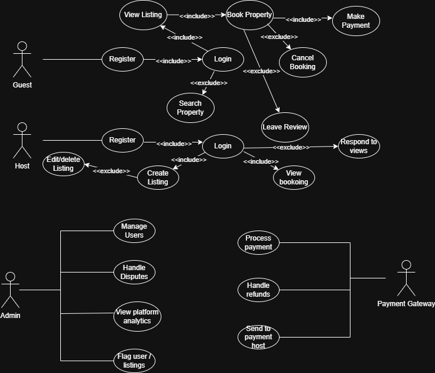

# 🎭 Airbnb Clone – Use Case Diagram

This document presents a **Use Case Diagram** that visualizes the interactions between users and the backend system of the Airbnb Clone application.

---

## 🎯 Objective

To model how **Guests**, **Hosts**, **Admins**, and external services (e.g., Payment Gateway) interact with the system to accomplish key actions like booking a property or processing payments.

---

## 👥 Actors

- **Guest**: A user looking to rent a property
- **Host**: A user offering a property for rent
- **Admin**: A system administrator with elevated privileges
- **Payment Gateway**: External service (e.g., Stripe, PayPal)

---

## 🗂️ Key Use Cases

### Guest

- Register/Login
- Search for listings
- View listing details
- Book property
- Cancel booking
- Make payment
- Leave review

### Host

- Register/Login
- Create listing
- Edit/Delete listing
- View bookings
- Respond to reviews

### Admin

- Manage users
- View platform analytics
- Ban/flag users or listings
- Handle disputes

### Payment Gateway

- Process payments
- Handle refunds
- Send payout to host

---

## 🖼️ Use Case Diagram

---
